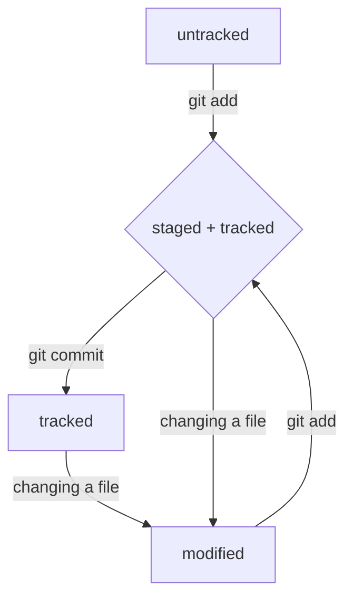

### Навигация
`pwd` (от англ. _print working directory_, «показать рабочую папку») — покажи, в какой я папке;

`ls` (от англ. _list directory contents_, «отобразить содержимое директории») — покажи файлы и папки в текущей папке;

`ls -a` — покажи также скрытые файлы и папки, названия которых начинаются с символа __`.`__;

`cd first-project` (от англ. _change directory_, «сменить директорию») — перейди в папку `first-project`;

`cd first-project/html` — перейди в папку `html`, которая находится в папке `first-project`;

`cd ..` — перейди на уровень выше, в родительскую папку;

`cd ~` — перейди в домашнюю директорию (`/Users/Username`);

`cd /` — перейди в корневую директорию.

### Работа с файлами и папками

#### Создание

`touch index.html` (англ. _touch_, «коснуться») — создай файл `index.html` в текущей папке;

`touch index.html style.css script.js` — если нужно создать сразу несколько файлов, можно напечатать их имена в одну строку через пробел;

`mkdir second-project` (от англ. _make directory_, «создать директорию») — создай папку с именем `second-project` в текущей папке.

#### Копирование и перемещение

`cp file.txt ~/my-dir` (от англ. _copy_, «копировать») — скопируй файл в другое место;

`mv file.txt ~/my-dir` (от англ. _move_, «переместить») — перемести файл или папку в другое место.

#### Чтение

`cat file.txt` (от англ. _concatenate and print_, «объединить и распечатать») — распечатай содержимое текстового файла `file.txt`.

#### Удаление

`rm about.html` (от англ. _remove_, «удалить») — удали файл `about.html`;

`rmdir images` (от англ. _remove directory_, «удалить директорию») — удали пустую папку `images`;

`rm -d images` - также можно удалить пустую папку.

`rm -r second-project` (от англ. _remove_, «удалить» + _recursive_, «рекурсивный») — удали папку `second-project` и всё, что она содержит.

#### Полезные возможности

Команды необязательно печатать и выполнять по очереди. Можно указать их списком — разделить двумя амперсандами (`&&`).

У консоли есть собственная память — буфер с несколькими последними командами. По ним можно перемещаться с помощью клавиш со стрелками вверх (`↑`) и вниз (`↓`).

Чтобы не вводить название файла или папки полностью, можно набрать первые символы имени и дважды нажать `Tab`. Если файл или папка есть в текущей директории, командная строка допишет путь сама.

Например, вы находитесь в папке `dev`. Начните вводить `cd first` и дважды нажмите `Tab`. Если папка `first-project` есть внутри `dev`, командная строка автоматически подставит её имя. Останется только нажать `Enter`.

### GIT

#### Создание коммита

`git init` - инициализация репозитория в папке проекта.

`git status` - проверка статуса, или состояния, репозитория.

`rm -rf .git` - Если вы ошиблись и случайно инициализировали не ту папку, можно «разгитить» её — удалить скрытую подпапку `.git`.
    * ключ `-r` (от англ. _recursive_ — «рекурсивно») позволяет удалять папки вместе с их содержимым;
    * ключ `-f` (от англ. _force_ — «заставить») избавит вас от вопросов вроде «Вы точно хотите удалить этот файл? А этот? И этот тоже?». 

Но ни в коем случае не вводите в Linux `sudo rm -rf /*` - после выполнения система начнет рекурсивно удалять вообще все файлы, начиная с корневой директории, пока система не зависнет с сообщением “Error deleting file”.

`git add` - позволяет подготовить файл к сохранению.

`git add --all` - подготовит к сохранению сразу все файлы.

`git add .` - можно добавить в репозиторий текущую папку со всеми файлами.

`git commit -m 'пояснение для коммита'` - делаем коммит. Ключ `-m` позволяет присвоить коммиту сообщение. Помните, что такие сообщения должны быть информативными: чётко описывать изменения.

#### `log`

`git log` — (от англ. _log_ — «журнал [записей]») используйте её, чтобы посмотреть коммиты проекта. В выводе появится список коммитов, например:
```bash
commit e83c5163316f89bfbde7d9ab23ca2e25604af290        # строка из цифр и латинских букв после слова commit — это хеш коммита;
Author: Linus Torvalds <torvalds@linux-foundation.org> # имя автора и его электронная почта;
Date:   Thu Apr 7 15:13:13 2005 -0700                  # дата и время создания коммита;

    Initial revision of "git", the information manager from hell  # сообщение коммита.
```

`git log --oneline` - получить сокращённый лог; флаг `--oneline` (англ. «одной строкой») сократит в терминале вывод хеша каждого коммита до нескольких символов и информационной записи коммита:
``` bash
7f25d69 (HEAD -> master, origin/master) add README.md
```

#### `HEAD`

`HEAD` (англ. «голова», «головной») — один из служебных файлов папки `.git`. Он указывает на коммит, который сделан последним (то есть на самый новый). Внутри `HEAD` — ссылка на служебный файл: `refs/heads/master` (или `refs/heads/main` в зависимости от названия ветки). Если заглянуть в этот файл (`cat refs/heads/master`), можно увидеть хеш последнего коммита.

#### Статусы `untracked/tracked`, `staged` и `modified`

`untracked` (англ. «неотслеживаемый») - новые файлы в Git-репозитории помечаются как `untracked`, то есть неотслеживаемые. Git «видит», что такой файл существует, но не следит за изменениями в нём. У `untracked`-файла нет предыдущих версий, зафиксированных в коммитах или через команду `git add`.

`staged` (англ. «подготовленный») - После выполнения команды `git add` файл попадает в `staging area` (от англ. _stage_ — «сцена», «этап [процесса]» и _area_ — «область»), то есть в список файлов, которые войдут в коммит. В этот момент файл находится в состоянии `staged`. `Staging area` также называют `index` (англ. «каталог») или `cache` (англ. «кеш»)

`tracked` (англ. «отслеживаемый») — это противоположность `untracked`. Оно довольно широкое по смыслу: в него попадают файлы, которые уже были зафиксированы с помощью `git commit`, а также файлы, которые были добавлены в `staging area` командой `git add`. То есть все файлы, в которых Git так или иначе отслеживает изменения.

`modified` (англ. «изменённый») - означает, что Git сравнил содержимое файла с последней сохранённой версией и нашёл отличия. Например, файл был закоммичен и после этого изменён.

Для файлов в состояниях `staged` и `modified` обычно не указывают, что они также `tracked`, потому что это состояние подразумевается.

#### Типичный жизненный цикл файла в Git


#### `status`

`git status` - проверка статусов файлов. показывает только следующие состояния файлов:
- `staged (Changes to be committed в выводе git status)`;
- `modified (Changes not staged for commit)`;
- `untracked (Untracked files)`.

#### Как исправить коммит

`git commit --amend --no-edit` - внести правки в уже сделанный коммит с помощью опции `--amend` (от англ. _amend_ — «исправить», «дополнить»); `--no-edit` - сообщает команде `commit`, что сообщение коммита нужно оставить как было.

#### Изменить сообщение коммита

`git commit --amend -m "Новое сообщение"` - меняем сообщение в коммите на "Новое сообщение".

#### unstage

`git restore --staged <file>` - переводим `<file>` из `staged` обратно в `untracked`.

#### "Откат" коммита

`git reset --hard <commit hash>` (от англ. _reset_  — «сброс», «обнуление» и _hard_ — «суровый») вернуть состояние репозитория к более раннему.

#### «Откатить» изменения, которые не попали ни в `staging`, ни в коммит

Может быть так, что вы случайно изменили файл, который не планировали.  Теперь он отображается в `Changes not staged for commit (modified)`.
`git restore <file>` - отменить такие изменения в файле.

### GITHUB

`git remote add origin git@github.com:%ИМЯ_АККАУНТА%/first-project.git` - соединяем локальный репозиторий с репозиторием на GitHub;
    * `git remote add` (от англ. _remote_ — «удалённый» и _add_ — «добавить») - Привязать удалённый репозиторий к локальному;
    * `origin` (англ. «источник») — стандартный псевдоним, с помощью которого можно обращаться к главному удалённому репозиторию (обычно такой репозиторий один);
    * `git@github.com:%ИМЯ_АККАУНТА%/first-project.git` - URL скопированный со страницы удалённого репозитория.

`git remote -v` - проверка связанности репозиториев; флаг `-v` — короткая форма флага `--verbose` (англ. «подробный»). Он позволяет показать больше информации в выводе. В выводе вы должны увидеть две строчки:
```bash
origin    git@github.com:%ИМЯ_АККАУНТА%/%ИМЯ-ПРОЕКТА%.git (fetch)
origin    git@github.com:%ИМЯ_АККАУНТА%/%ИМЯ-ПРОЕКТА%.git (push) 
```

`git push -u origin main` - загружаем содержимое локального репозитория на GitHub, в первый раз эту команду нужно вызвать с флагом `-u` и параметрами `origin` (имя удалённого репозитория) и `main` или `master` (название текущей ветки);
    * `git push` (от англ. push — «толкать») - непосредственно выполняет загрузку;
    * флаг `-u` свяжет локальную ветку с одноимённой удалённой.

В дальнейшем при работе с удалённым репозиторием флаг `-u` можно опустить и писать просто `git push`.

